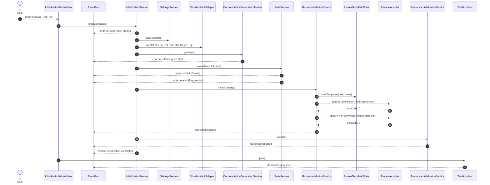
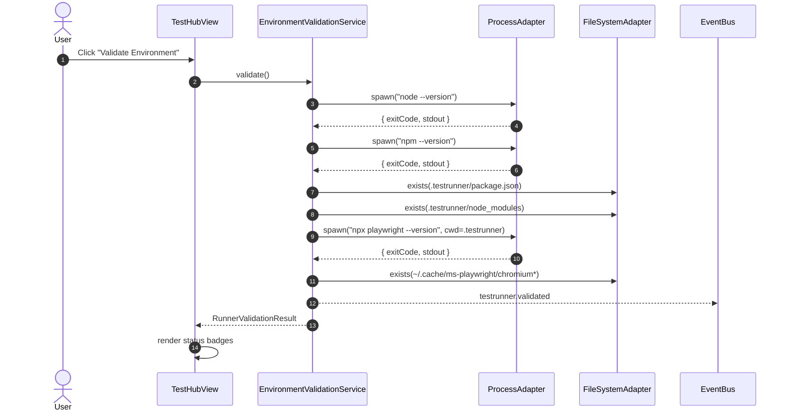
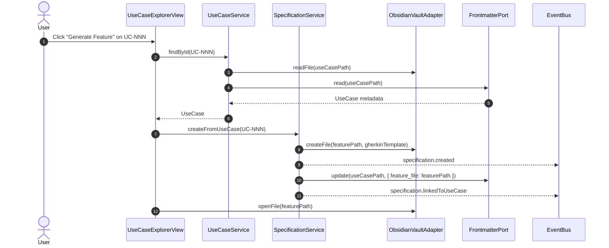
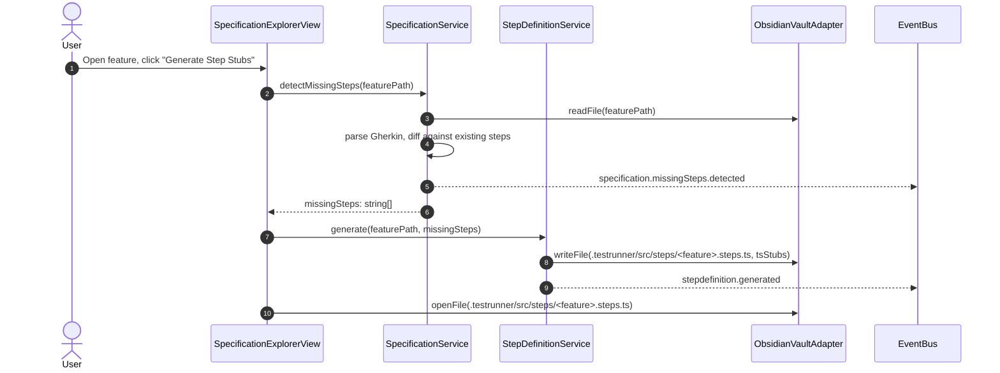
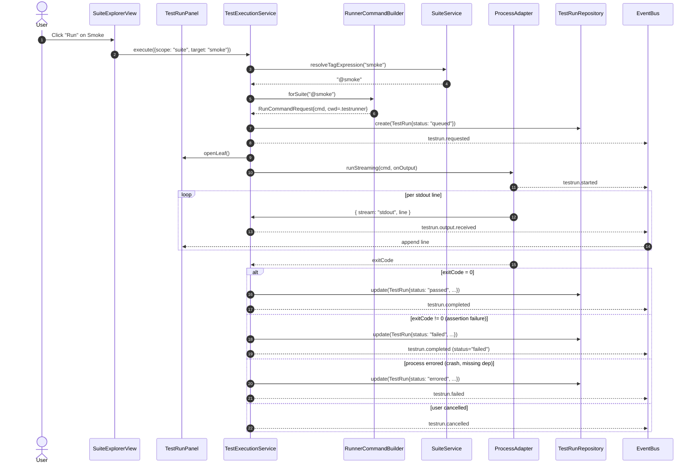
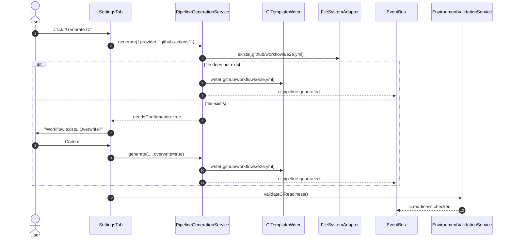
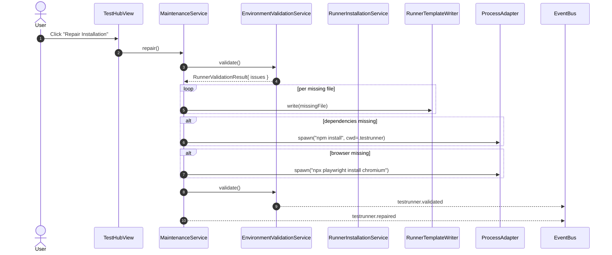

# Runtime View — Obsidian E2E Test Hub

> Arc42 §6 runtime view. Sequence diagrams and step-by-step traces for the critical V1 scenarios, showing which services collaborate, which adapters they call, and which domain events fire in which order.

- **Version:** 1.0
- **Status:** Draft
- **Architecture Stage:** Solution Design / Arc42 §6 (Runtime View)
- **Companion documents:** [[Obsidian E2E Test Hub]], [[Solution Design]], [[Building Block View]], [[Technical Interface Specification]], [[Event Catalog]]

---

## Scenario index

| # | Scenario | Use case(s) | Trigger |
| --- | --- | --- | --- |
| RV-1 | Initialize Test Hub | UC-001 | User clicks **Initialize Test Hub** in `InitializationWizardView`. |
| RV-2 | Validate Environment | UC-002 | User clicks **Validate Environment** or `EnvironmentValidationService` is called by another flow. |
| RV-3 | Generate Feature Specification | UC-006 | User clicks **Generate Feature** in `UseCaseExplorerView`. |
| RV-4 | Generate Step Definition Stub | UC-010 | User clicks **Generate Step Stubs** in `SpecificationExplorerView`. |
| RV-5 | Execute Test Suite | UC-013, UC-015 | User clicks **Run** on a suite in `SuiteExplorerView`. |
| RV-6 | Generate Evidence (post-run) | UC-016 | A terminal run event fires; the `PostRunCoordinator` continues in-process as a continuation of any execution scenario. |
| RV-7 | Generate CI Pipeline | UC-019 | User clicks **Generate CI** in `SettingsTab` or `TestHubView`. |
| RV-8 | Repair Installation | UC-003 | User clicks **Repair Installation** in `TestHubView`. |

Conventions:

- Solid arrows = command / call. Dashed arrows = events on the `EventBus`.
- Adapters and ports prefixed with their layer (`infra.*`, `port.*`).
- All events listed in the diagrams have full payload shapes in the [Event Catalog](./Event%20Catalog.md).

---

## RV-1 — Initialize Test Hub (UC-001)

**Trigger.** First-run user opens the Test Hub and clicks **Initialize Test Hub** in the modal.

**Postconditions.** Vault folders exist, default suites exist, `.testrunner` is installed and validated, dashboard refreshes. The demo test is **not** auto-run (AD-1).



**Failure paths.**

- Any step error → `InitializationService` catches, publishes `testhub.initialization.failed` with `{ reason, step }`, and `InitializationWizardView` shows retry. Partial state is left in place; **the user must explicitly invoke `MaintenanceService.repair()` or `MaintenanceService.reset()` to recover** (UC-003 / UC-024).
- `npm install` non-zero exit → `RunnerInstallationService` returns `Result.ok = false`; init flow surfaces the failure and skips browser install.

**Correlation.** All events in this scenario share `correlationId = initialization invocation id` per Event Catalog §19.

---

## RV-2 — Validate Environment (UC-002)

**Trigger.** User clicks **Validate Environment** or upstream service calls `EnvironmentValidationService.validate()`.



**Notes.**

- Result is purely diagnostic — no state mutation.
- `RunnerValidationResult.issues[]` carries `{ code, message, severity }` so the UI can deep-link to remediation: **Repair** (RV-8) for `RUNNER_MISSING_FILE`, **Re-install** for `BROWSER_NOT_INSTALLED`.

---

## RV-3 — Generate Feature Specification (UC-006)

**Trigger.** User opens a Use Case note and clicks **Generate Feature**.



**Template.** The generated feature uses the Use Case title as `Feature:` and seeds one empty `Scenario:` block. Tags inferred from the Use Case domain (e.g. `@smoke` for Installation UCs).

---

## RV-4 — Generate Step Definition Stub (UC-010)

**Trigger.** User opens a feature with undefined steps and clicks **Generate Step Stubs**.



**Stub content.** Each missing step becomes a TypeScript function with `@cucumber/cucumber` decorators, a `TODO` comment, and `throw new Error('Pending')`.

---

## RV-5 — Execute Test Suite (UC-013 + live monitor UC-015)

**Trigger.** User clicks **Run** on a suite.

**Postconditions.** Run records exist; one terminal event fires (`testrun.completed`, `testrun.failed`, or `testrun.cancelled`); evidence generation kicks off as a continuation (RV-6).



**Terminal-event invariant.** Exactly one of `testrun.completed` / `testrun.failed` / `testrun.cancelled` per run (per EN-2). Subscribers waiting on terminal state listen to all three. The `PostRunCoordinator` is one such subscriber — it continues into RV-6 (import → evidence → dashboard refresh) in-process; there is no `ReportFileWatcher` and no `report.detected` event.

**Correlation.** `correlationId = runId` for all `testrun.*`, `report.*`, and downstream `evidence.*` events.

---

## RV-6 — Generate Evidence (UC-016)

**Trigger.** A terminal run event (`testrun.completed` / `testrun.failed` / `testrun.cancelled`) fires; the `PostRunCoordinator`, subscribed to all three, continues in-process (continuation of any RV-5 path). There is no `ReportFileWatcher` and no `report.detected` event.

```mermaid
sequenceDiagram
    autonumber
    participant Bus as EventBus
    participant Exec as TestExecutionService
    participant Coord as PostRunCoordinator
    participant Import as ReportImportService
    participant Parse as ReportParserAdapter
    participant Ev as EvidenceGenerationService
    participant Vault as ObsidianVaultAdapter
    participant FM as FrontmatterPort
    participant Trace as TraceabilityService
    participant Hub as DashboardView

    Bus-->>Coord: testrun.completed / failed / cancelled
    Coord->>Exec: lastRun()
    Exec-->>Coord: TestRun (just finished)
    Note over Coord: skip errored runs (no report); serialize via evidence chain
    Coord->>Import: import(run)
    Import->>Parse: parse(.testrunner/reports/...)
    Parse-->>Import: ImportedReport
    Import-->>Bus: report.imported
    Coord->>Ev: generate({ run, report })
    Ev->>Vault: createFile(Test Evidence/.../summary.md)
    Ev-->>Bus: evidence.generated
    Ev->>FM: update(useCasePath, { last_evidence, last_test_status })
    Ev-->>Bus: evidence.linkedToUseCase
    Coord->>Trace: refreshDashboard()
    Trace-->>Bus: dashboard.refreshed
    Trace-->>Bus: dashboard.kpi.updated
    Bus-->>Hub: re-render (reads snapshot(), no re-emit)
```

**Loop avoidance (P2-6).** The coordinator PUSHES `refreshDashboard()` (which emits `dashboard.refreshed`/`dashboard.kpi.updated`) so the KPIs update even when no view is open. A `DashboardView` reacting to those events re-renders from the **non-emitting** `TraceabilityService.snapshot()`, so the render cannot re-trigger a refresh.

**Evidence note.** Markdown with frontmatter (`type: test-evidence`, `run_id`, `linked_use_cases`, etc.) plus a body section that **links** to artifacts in `.testrunner/reports/...` rather than copying them (per OQ-002 default resolution: link, do not duplicate).

---

## RV-7 — Generate CI Pipeline (UC-019)

**Trigger.** User clicks **Generate CI** in `SettingsTab` or `TestHubView`.



**Decision (OQ-005 default).** Never overwrite existing workflow files without explicit user confirmation.

**CI workflow location.** Repo root `.github/workflows/e2e.yml` per AD-3; `CiTemplateWriter` uses `FileSystemAdapter` (not `ObsidianVaultAdapter`) because the path may sit outside Obsidian's vault index.

---

## RV-8 — Repair Installation (UC-003)

**Trigger.** User clicks **Repair Installation** (often after a failed RV-1 or a manual `.testrunner` edit).



**Idempotency.** `repair()` is safe to invoke repeatedly. It does not delete user-authored content under `.testrunner/src/steps` or `.testrunner/src/pages`.

---

## Cross-scenario invariants

| Invariant | Where enforced |
| --- | --- |
| Terminal-event uniqueness for any `testrun.*` | `TestExecutionService` state machine; see EN-2. |
| `correlationId` constant across a logical flow; `causationId` chains events | `EventBus` publishers respect Event Catalog §19. |
| Domain layer publishes no I/O | Module dependency rules in BBV §10; enforced via ESLint `no-restricted-imports`. |
| Reports never duplicated into the vault | Evidence notes hold relative paths into `.testrunner/reports`; `EvidenceGenerationService` writes links only. |
| Workflow files at repo root, not in the vault | AD-3; `CiTemplateWriter` uses `FileSystemAdapter` not `ObsidianVaultAdapter`. |
| `.testrunner` hidden by default | Obsidian's default dotfile behavior; no plugin action needed (OQ-001 default resolution). |

---

## Scenarios deferred

| Scenario | Use case | Reason for deferral |
| --- | --- | --- |
| Execute Use Case | UC-011 | Structurally identical to RV-5 with `scope: "use-case"`; covered by the same diagram. |
| Execute Feature | UC-012 | Same shape as RV-5 with `scope: "feature"`. |
| Execute Full Regression | UC-014 | Same shape as RV-5 with `scope: "all"`. |
| Reset Test Hub | UC-024 | Sequence: confirm → delete `Test Hub`, `Use Cases`, `Specifications`, `Test Suites`, `Test Evidence`, `.testrunner` → invoke RV-1. To be diagrammed if reset behavior diverges from init. |
| Edit Use Case / Edit Feature | UC-005, UC-007 | Pure vault edits; no service orchestration beyond `usecase.updated` / `specification.updated`. |
| Open documentation views | UC-021, UC-022, UC-023 | One-step open from `TestHubView` to `DocumentationView`; no service chain. |
